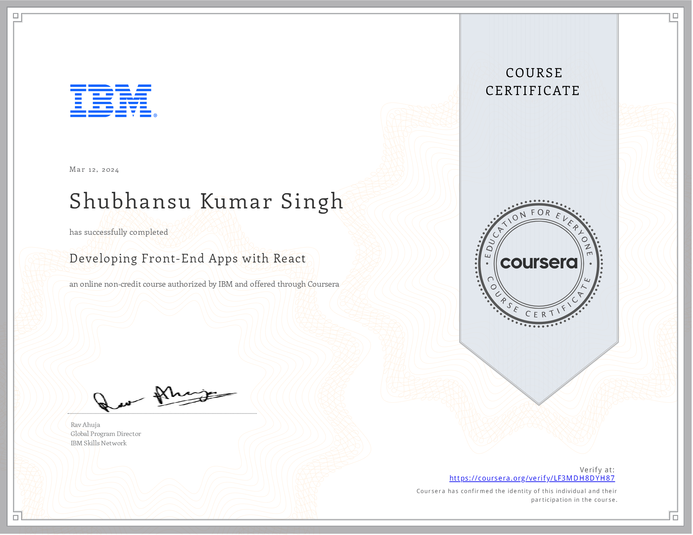

# INT252: Web App Development with React JS

> Sem 6 : Engineering Major C3 
>  L:2   T:0   P:2    Credits:3  

This repo tracks the progress of the course INT252 and contains resouce for the same. This course was conducted in a blended mode, in collaboration with Coursera. We were given three coursera course to complete which was credited by the university.

1. [React Basics](https://www.coursera.org/programs/int252-web-app-development-with-react-js-batch-3-jx9t8/learn/react-basics?collectionId=FORCR) by Meta.
2. [Advance React](https://www.coursera.org/programs/int252-web-app-development-with-react-js-batch-3-jx9t8/learn/advanced-react?collectionId=FORCR) by Meta.
3. [Developing frontend apps with react](https://www.coursera.org/programs/int252-web-app-development-with-react-js-batch-3-jx9t8/learn/developing-frontend-apps-with-react?collectionId=FORCR) by IBM.

## Documentation

1. [`app`](./app/) folder serves as the one point application for learning and experimenting around react, instead of creating a new react app for each tutorial.
2. [`Learnings`](./Learnings/) folder contains all the react files created during the learing of the course.
3. [`Project - ImagineEvent`](./Project%20-%20ImaginEvent/) folder contains the project created for the course final submisison.
4. [`React`](./React/) folder contains the solution to the end term practical problem statement given for the evaluation. 
5. [`Certificates`](./Certificates/) folder contains certificates to all three courses given for credit completion. 

## Certificates

Click here to view the certificates

1. [React Basics](./Certificates/Coursera%20R3Y34MU5MEN8%20-%20React%20Basics.pdf)  

2. [Advanced React](./Certificates/Coursera%20LWT4P76SYH3Y%20-%20Advanced%20React.pdf)  

3. [Developing Front-End apps with React](./Certificates/Coursera%20LF3MDH8DYH87%20-%20Developing%20frontend%20app%20with%20react%20-%20IBM.pdf)  

